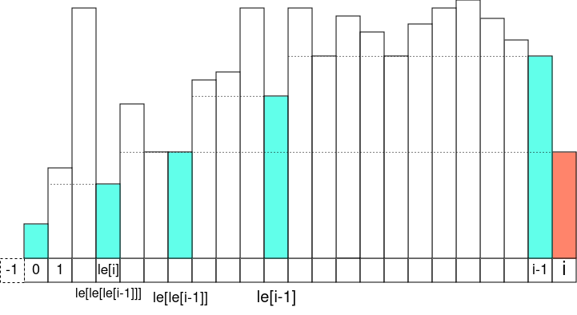
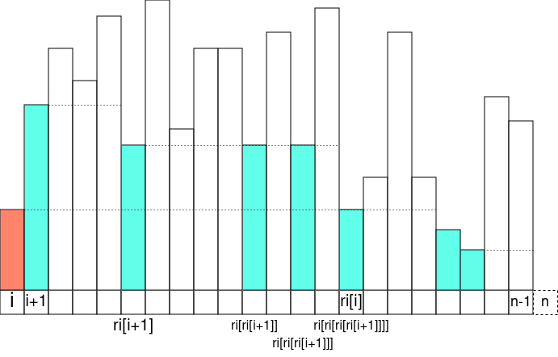

`vector<int> le = mono_st(a, less());`

`vector<int> ri = mono_range(le);`

For cartesian binary tree, the invariant is on the `i`-th iteration, the
cartesian tree is built for the `i`-th prefix. Then the inner `j` loop can be
thought of as looping up the "right spine" of blue nodes:

